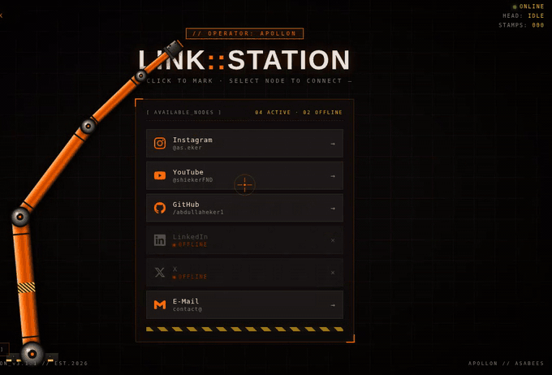
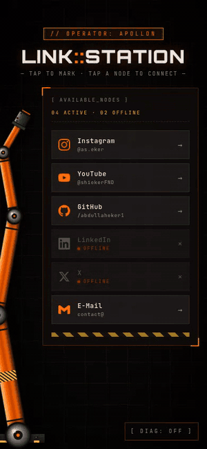

# LINK::STATION

**Live:** https://abdullaheker1.github.io/link-station/

A personal link-in-bio page guarded by a 4-DOF industrial robot arm. The arm has joint motors with real speed and acceleration limits, an analytic posture solver, and a stamping head: it follows your pointer, docks on whichever node you hover, and seals it with a pneumatic stamp when you click. On phones it lives in a rail beside the panel and reaches in from there. Zero build step — one HTML file plus a data file, served by GitHub Pages.

<p>
  
  
</p>

---

## Bu ne?

shekerFND'nin bağlantı sayfası: Instagram, YouTube, GitHub, e-posta. Sıradan bir liste yerine KUKA-turuncusu bir robot kol imleci takip eder, üzerine geldiğin düğüme (node) yanaşır, tıklayınca damga basar.

### Etkileşim

| Yaptığın | Olan |
|---|---|
| İmleci gezdirmek | Kol imleci takip eder — ama ışınlanmaz: her eklemin hız/ivme sınırı vardır, hızlı bir savruluşta geride kalır ve makine gibi yetişir; varışta servo oturması titrer. Retikül menzil dışındaysa kırmızıya döner (`OUT OF REACH`). |
| Boş bir yere tıklamak | Kol işe kilitlenir (`APPROACH`), noktaya varınca pnömatik damga döngüsünü çalıştırır (PRESS → PRINT → RETRACT) ve turuncu altıgen bir iz bırakır; iz 3,5 sn'de solar. |
| Bir node'un üzerine gelmek | Kol satırın sol kenarındaki **porta kilitlenir**; HUD `TGT: GITHUB // LOCKED` yazar, portta yeşil halka döner. |
| Kilitliyken tıklamak | Porta yeşil `ROUTED // GITHUB` mührü basılır; link yeni sekmede açılır, döndüğünde mühür seni bekler. |
| OFFLINE bir node'a gelmek | Kol yanaşmayı reddeder: kırmızı ✕, retikülde `NO ROUTE`. |
| `D` tuşu / `[ DIAG ]` düğmesi / `?diag` | **Diagnostik modu**: kol yarı saydamlaşır; iskelet, eklem açıları (A1–A4), uzuv boyları, çalışma uzayı halkası, hedef vektörü ve çözücü okuması görünür. |
| `Tab` + `Enter` | Klavyeyle de kilitlenir ve damgalanır. |
| **Telefonda** | Kol panelin solundaki rayda katlanmış bekler; bir node'a dokununca porta −45°'den yanaşıp mühürler, boş bir yere dokununca oraya gidip iz bırakır ve raya döner. Parmak ekrandayken parmağı izler. |
| Sistem "hareketi azalt" ayarı | HUD `MODE: REDUCED-MOTION` gösterir. Kol imleci kovalamaz (park pozunda bekler) ama yanaşma ve damga gibi kısa, istenen hareketler çalışır. `[ MOTION: FULL ]` düğmesi bu sayfa için ayarı geçersiz kılar (tarayıcıda hatırlanır). Linux/GNOME'da "Animasyonlar: kapalı", Windows'ta "Animasyon efektleri" bu ayarı tetikler. |

Bir şey olmadığında döngü uyur (HUD: `STANDBY`); ilk hareketle uyanır.

### Linkleri düzenlemek

Tek dosya: [`links.js`](links.js). `index.html`'e dokunman gerekmez.

```js
{ name: 'YouTube', handle: '@shiekerFND', url: 'https://www.youtube.com/@shiekerFND', icon: 'youtube' },
```

- `url` boşsa (`''`) node **OFFLINE** görünür (gri, tıklanmaz, kırmızı LED). Panel başlığındaki `04 ACTIVE · 02 OFFLINE` sayısı otomatiktir.
- Yeni bir platform ikonu için [`icons.js`](icons.js) içindeki nota bak (simpleicons.org'dan `path` kopyala).
- GitHub'da dosyayı düzenleyip commit'lemen yeterli; Pages birkaç dakikada yayınlar.

### Dosyalar

```
index.html   sayfa: stil, panel, robot kol motoru (yorumlar öğrenme amaçlı korunmuştur)
links.js     düzenlenecek tek dosya: node tablosu
icons.js     SVG ikon path'leri
assets/      favicon.svg, apple-touch-icon.png, og.png (paylaşım önizlemesi), demo.gif, demo-mobile.gif
```

### Nasıl çalışıyor (kısaca)

- **Eklemler:** Durum, gerçek kontrolcülerdeki gibi göreli eklem açılarıdır (`q[0]` mutlak taban, `q[1..3]` bir önceki uzva göre; A1–A4). Her eklemin açı aralığı vardır: taban yerden ≥ 30°, A2 ±152°, A3 ±125°, A4 ±100° — bilek kendi üstüne katlanamaz.
- **Duruş çözücü (`solveGoal()`):** İteratif değil, analitik. Alet yönü (yanaşmada sabit, serbest takipte omuzdan hedefe), bilek merkezi = hedef − L4, ön kol omuzdan bileğe, dirsek noktası = bilek − L3; kalan iki uzuv için kapalı form 2-uzuv IK. İki ayna çözümden eklem aralıklarına uyup bileği en az büken kazanır. Aynı hedef → her zaman aynı poz; titreme ve yerel minimum yok. Kod: `posture()`, `solveGoal()`.
- **Motorlar (`updateMotors()`):** Çözücü yalnızca `goalQ` üretir; her eklemi trapez hız profili (eklem başına `vMax`/`aMax`, küçük uzuvlar daha hızlı) hedefe taşır. Varışta tepe hıza orantılı, sönümlü bir servo halkası çizime eklenir.
- **Menzil (`checkReach()`):** Duruş kuralı için kesin test: hedefin ima ettiği dirsek noktası tabanın etrafındaki iki-uzuv halkasında (dış = L1+L2, iç = dirsek limitinde) mi? Dışarıdaysa kol uzanabildiği yere basar ve iz `LIMIT` etiketi alır.
- **Damga:** 4 fazlı durum makinesi (`APPROACH → 140 / 60 / 260 ms`), 30 izlik ring buffer. Kol işi bitirene kadar imleci yok sayar.
- **Telefon sahnesi:** 64 px sol ray; kol boyu tezgâha göre büyütülür (her porta yanaşabilene kadar, ≤ 0,95 × yükseklik); bekleme pozu `HOME_Q` eklem uzayında tanımlıdır; katlanan dirsek panel yerine ekran kenarını tercih eder.
- **Node kilidi:** `pointerover` / `focusin` ile satır yakalanır; hedef, satırın 16 px solundaki port olur.
- **Uyku:** Kol hedefe oturmuş, damga döngüsü boş, iz kalmamış ve 1,2 sn girdi yoksa `requestAnimationFrame` durur.

Detaylar `index.html` içindeki bölüm başlıklı yorumlarda.

### Geliştirme

Dosyayı tarayıcıda açman yeterli (`file://` çalışır). Değişiklikten sonra kontrol listesi:

- 1440×900, 768×1024, 390×844 ve **320×568** — son link erişilebilir mi?
- Konsolda hata yok mu?
- `?diag` ile kol hedefe oturuyor mu (`ERR` ~0, `MOTORS err` ~0)? Yeşil hayalet (hedef poz) ile turuncu iskelet (motorlar) üst üste biniyor mu?
- Telefon boyutunda (`390×844`) tüm portlar `ELBOW RING` içinde mi; kol rayda mı bekliyor?

### Geçmiş

- **v2.6** (Mayıs 2026) — Claude 4.7 Opus ile üretildi: kol, damga, HUD, mobil düzen.
- **v3.0** (Eylül 2026) — Claude Opus 5 ile yenilendi: `links.js`, OFFLINE node'lar, node kilidi + ROUTED mührü, diagnostik modu, uyuyan render döngüsü, `dvh` ile mobil kaydırma, reduced-motion, klavye odağı, OG/favicon.
- **v3.1** (Eylül 2026) — "Sahne + beden": eklem motorları (hız/ivme profili, servo oturması), eklem aralıkları, analitik duruş çözücü (CCD kaldırıldı), yanaşmada bilek yönelimi, `APPROACH` fazı; telefonda sol ray, tezgâha göre kol boyu, ev pozu, dokunmayla yönlendirme.
- **v3.1.1** — Azaltılmış hareket düzeltmesi: sistem "animasyonlar kapalı" iken kol tamamen donuyordu; artık yalnızca imleç takibi kapanır, HUD durumu gösterir ve `[ MOTION: FULL ]` ile geçersiz kılınabilir. Render döngüsü hata korumalı.

MIT — bkz. [LICENSE](LICENSE).
